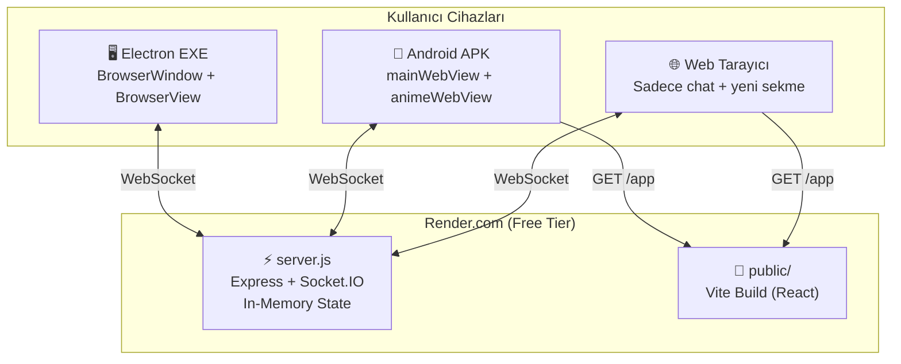

# AniSync - Tüm Proje Belgeleri ve Geliştirme Notları

## README.md

<div align="center">
  
  <h1>AniSync</h1>
  <p>Anime Watch Party & Synchronized Streaming Platform</p>
</div>

## 📺 Overview
AniSync is a modern, cross-platform application (Windows Desktop & Android) that allows you and your friends to watch anime together perfectly synchronized in real-time. It features built-in chat, automatic synchronization, and a beautiful, dynamic UI with multiple premium themes.

## ✨ Features
* **Perfect Synchronization:** Watch anime together with millimeter-perfect syncing. If someone pauses, it pauses for everyone.
* **Cross-Platform:** Available as a Windows Desktop application and an Android mobile app.
* **Premium Themes:** Includes "Minimal Gemini Dark" and "Anime Sync Classic" dynamic color themes.
* **Watch Parties:** Create rooms, invite friends, and start watching instantly.
* **Real-time Chat:** Communicate with your watch party members directly within the app.

## 🚀 Download & Installation

The easiest way to install AniSync is to download the compiled binaries from the [Releases](../../releases/latest) page.

### For Windows:
1. Download `AniSync-Windows.zip` from the latest release.
2. Extract the folder to your desired location.
3. Run `AniSync.exe` inside the folder. No installation required!

### For Android:
1. Download `AniSync.apk` from the latest release.
2. Transfer it to your Android device (or download directly on your phone).
3. Open the APK to install. *(You may need to allow installation from unknown sources).*

## 🛠️ Development Setup

If you want to modify or compile the project yourself:

### Prerequisites
* Node.js (v20+)
* npm

### Installation
```bash
# Clone the repository
git clone https://github.com/LunaticZen/anisync_1.0.git

# Navigate into the directory
cd anisync_1.0

# Install dependencies
npm install
```

### Running Locally
```bash
# Start the Desktop App
npm run dev:desktop

# Start the Local Server
npm run dev:server
```

### Building
```bash
# Build Windows EXE
npm run build:desktop
npm run package

# Build Android APK (Requires Android Studio/Gradle)
cd packages/mobile
gradlew assembleDebug
```

## 📄 License
This project is for personal use and watch parties.


---

## claude.md

## Context Navigation
1. ALWAYS query the knowledge graph first.
2. Only read raw files if I explicitly say so.

## Proje Özeti (AniSync)
Bu proje tam teşekküllü bir **monorepo** yapısındadır. Eski `anisync-server` reposu iptal edilmiş olup her şey bu repodan (main branch) yönetilmektedir:
- `/packages/desktop`: Masaüstü uygulaması (Electron + React).
- `/packages/mobile`: Mobil uygulaması (APK - Android).
- `/packages/render-server`: Render.com üzerinde deploy edilen tek dosyalık sunucu.
- `/packages/shared`: Ortak kullanılan kodlar.

### Genel Kurallar
- Sürüm numaraları `packages/desktop/package.json`, `packages/mobile/package.json` ve `packages/desktop/src/components/HomePage.tsx` içerisinde güncellenir (Örn: v1.0.1).
- Uygulama arka planında "Aura" (Gemini tarzı dinamik gradyanlar) kullanılmaktadır. CSS'te düz renkler yerine gradientler tercih edilmelidir.
- Render.com güncellemeleri, GitHub `main` branchine doğrudan atılan pushlar ile otomatik gerçekleşir. (`packages/render-server` içinde asla `.git` klasörü barındırmayın).


## Detaylı Bilgi (Bilgi Havuzu)
Projenin detaylı kuralları, teknolojileri ve dosya yapısı `/wiki` klasöründe tutulmaktadır. 
Bana herhangi bir kod yazmadan veya işlem yapmadan önce, görevin içeriğine göre lütfen şu dosyalardan ilgili olanı Oku:
- Genel yapı için: `wiki/Dosya Yapısı.md`
- Mimari için: `wiki/Mimari Genel Bakış.md`
- Sorun çözümü için: `wiki/Bilinen Sorunlar ve Çözümler.md`


# AniSync Geliştirici Notları ve Çıkarılan Dersler (Wiki)

Bu döküman, AniSync'e eklenen "Resim Yükleme ve Tam Ekran (Lightbox) Özelliği" geliştirilirken karşılaşılan kritik hataları, nedenlerini ve çıkarılan dersleri belgelemek amacıyla oluşturulmuştur. İleride benzer özellikler geliştirilirken bu notlara dikkat edilmelidir.

## 1. Sunucu Tarafı Güvenlik Limitleri (Payload Truncation)
**Hata:** Kullanıcı arayüzünde Base64 olarak gönderilen resimler yerel (local) geliştirme ortamında sorunsuz çalışırken, canlı (Render) sunucusuna yüklendiğinde resimler bozuk görünüyor ve mesaj metni `[upload:data:image/jpeg;base64,...` şeklinde yarım kesilmiş olarak ekrana düşüyordu.
**Neden:** `render-server/server.js` içerisindeki Soket mesaj dinleyicisinde, genel sohbet güvenliği ve performansını korumak adına tüm mesajları koşulsuz olarak 500 karakterde kesen bir limit bulunuyordu: `(data.text || '').slice(0, 500)`
**Çözüm:** Kesme işlemi uygulanmadan önce mesajın bir Base64 resim verisi olup olmadığı kontrol edildi. Eğer mesaj `[upload:data:image/` ile başlıyor ve `]` ile bitiyorsa, bu bir görsel upload komutu olarak kabul edilip uzunluk limiti (resimler için) 500.000 karaktere çıkarıldı.
**Alınan Ders:** Lokal geliştirme sunucusu (packages/server) ile bağımsız canlı prodüksiyon sunucusu (packages/render-server) arasındaki konfigürasyon ve limit farkları gözden kaçırılmamalıdır. Bir payload boyutu artırıldığında sunucudaki karakter kesme (slice/substring) mantığı mutlaka revize edilmelidir.

## 2. Global Obje Çakışmaları (Shadowing the Global Scope)
**Hata:** Resimli mesajlara alıntı (reply) yapıldığında sohbet alanında Base64 metni yerine şık bir "Görsel" ikonu göstermek için `lucide-react` kütüphanesinden `<Image>` ikonu import edildi. Bunu yaptıktan hemen sonra galeriden resim seçildiğinde resim chat'e gitmemeye (uygulama hata vermeye) başladı.
**Neden:** `import { Image } from 'lucide-react'` satırı, tarayıcının varsayılan HTML5 `Image` constructor'ını ezdi (shadowing). Galeriden resim seçildiğinde, resmi yeniden boyutlandırmak (resize) için kullanılan `const img = new Image()` satırı, React bileşenini çağırmaya çalıştığı için `TypeError` fırlatarak işlemi durdurdu.
**Çözüm:** Import satırı `import { Image as ImageIcon } from 'lucide-react'` olarak değiştirilip global `Image` sınıfının korunması sağlandı.
**Alınan Ders:** `Image`, `Event`, `File`, `URL`, `Window` gibi global Web API sınıflarıyla aynı isme sahip kütüphane modüllerini (örneğin UI İkonları) içeri aktarırken her zaman `as` anahtar kelimesi ile Alias (Takma ad) kullanarak isim çakışmalarının önüne geçilmelidir.

## 3. React Durum Yönetiminde ReferenceError (State Scope)
**Hata:** Mesaj balonlarına tıklanıldığında resmi tam ekran (lightbox) yapacak olan fonksiyon yazıldıktan sonra sohbete herhangi bir mesaj atıldığında uygulama çöküp "Beyaz Ekran" (White Screen of Death) verdi.
**Neden:** `ChatPanel` bileşeni içerisine eklenen `setLightboxImage` fonksiyonu, mesaj balonunu işleyen dışarıdaki `SwipableMessage` fonksiyonuna doğrudan parametre olarak aktarılmamıştı (Prop Drilling eksikliği). React, o kapsamda (scope) olmayan bir fonksiyonu çalıştırmaya çalışınca ReferenceError fırlattı.
**Çözüm:** `SwipableMessage` fonksiyonunun parametrelerine `onImageClick` eklendi ve `ChatPanel` üzerinden `setLightboxImage` durumu (state) doğru bir şekilde aşağı (child component'e) aktarıldı.
**Alınan Ders:** React'te bileşenleri dışarı çıkarırken (Extracting Components), kullanacakları tüm callback fonksiyonlarının (prop) doğru kapsamda tanımlanıp tanımlanmadığı ve aktarılıp aktarılmadığı kontrol edilmelidir.

## 4. Mobil Cihazlarda Event (Dokunmatik/Touch) Tetiklenmeleri
**Hata:** Mobil cihazda sohbet penceresindeki "Kalp" ve "Galeri (Resim Seçme)" ikonlarına dokunulduğunda telefonun sanal klavyesi istem dışı olarak açılıp kapanıyordu.
**Neden:** Mobil tarayıcılar (özellikle Android WebView/iOS Safari), ekrana dokunulduğunda sırasıyla `onTouchStart`, `onTouchEnd`, `onMouseDown` ve `onClick` olaylarını ateşler. Bu dokunma eylemleri, odaklanmış (focus) haldeki input alanının odağını kaybetmesine (blur) veya ekranın yenilenmesine yol açarak klavyenin davranışlarını bozar.
**Çözüm:** İlgili ikon butonlarına `onTouchStart={(e) => e.preventDefault()}` eklendi. `preventDefault()` metodu, tarayıcının o dokunmaya ait "odak değiştirme" (focus shift) gibi varsayılan davranışlarını engellediği için klavyenin gereksiz yere açılıp kapanması durduruldu.
**Alınan Ders:** İnteraktif mobil chat arayüzleri geliştirilirken butonlarda `onClick` kadar, mobilin kendi native dokunma event'leri olan `onTouchStart` ve `onTouchEnd` davranışları da (özellikle klavye yönetimi söz konusuysa) çok dikkatli yönetilmelidir.

## 5. CSS ve UX Detayları
**Yapılanlar:**
- Kullanıcının yüklediği resimler CSS ile `aspect-ratio: 1/1` ve `object-fit: cover` kullanılarak estetik kare formlara dönüştürüldü.
- Resme basıldığında büyüyen Lightbox modülüne `@keyframes` aracılığıyla `fadeIn` (kararma) ve `scaleUp` (büyüme) gibi akıcı geçiş animasyonları eklendi.
- Mobil tarayıcılarda resimlerin veya butonların üzerine tıklandığında çıkan varsayılan mavi dokunma yansıması, `-webkit-tap-highlight-color: transparent` özelliği ile kaldırılarak tasarımın Premium hissi artırıldı.

***
**Sürüm:** v1.2.0
**Tarih:** Haziran 2026

## 6. Mobil ve UI İyileştirmeleri (v1.3.0)
**Sorunlar ve Yapılanlar:**
- **Mobil Sync Hassasiyeti:** Mobildeki senkronizasyon toleransı (hostDrift) 3 saniyeden 0.5 saniyeye (500ms) düşürülerek çok daha hassas ve anlık bir izleme deneyimi sağlandı. (`RoomPage.tsx`)
- **Tema İkonu (Su Damlası):** Lobi ekranındaki tema değiştirme tuşu, seçili temanın vurgu rengiyle dinamik olarak uyum sağlayan özel bir 'Su Damlası' SVG ikonu ile değiştirildi. (`RoomHeader.tsx`)
- **Dokunma Yansıması (Fix):** Android/Mobil görünümde butonlara basıldığında ortaya çıkan çirkin mavi parlama efekti global CSS ile kapatılarak uygulamanın premium hissiyatı güçlendirildi. (`index.css`)

***
**Sürüm:** v1.3.0
**Tarih:** Haziran 2026


## 7. Custom Mesaj Baloncukları Sistemi (v1.3.0+)

### Genel Bakış
Sohbet baloncuklarına TikTok tarzı özel görsel temalar eklendi. Her tema tek bir PNG görselinden (`full.png`) CSS `border-image` 9-slice rendering kullanılarak çizilir. Bu sayede baloncuğun **sol ve sağ kenarları asla esnemiyor**, sadece **orta kısım yatayda** ve **dikeyde** esniyor.

### Dosya Yapısı
```
packages/desktop/public/bubbles/themes/
├── frog/full.png          # Kurbağa baloncuğu (434x139)
├── love/full.png          # Aşk baloncuğu (400x144)
├── cat/full.png           # Kedi baloncuğu (395x146)
├── pawprint/full.png      # Patiler baloncuğu (402x124)
├── galaxy/full.png        # Galaksi baloncuğu (477x119)
├── cloud/full.png         # Bulut baloncuğu (371x131)
├── pixel/full.png         # Piksel baloncuğu (390x118)
├── tape/full.png          # Not Kağıdı baloncuğu (401x121)
├── wave/full.png          # Dalga baloncuğu (437x123)
├── terminal/full.png      # Terminal baloncuğu (463x102)
├── ribbon/full.png        # Kurdele baloncuğu (398x120)
├── cheese/full.png        # Peynir baloncuğu (442x107)
├── wood/full.png          # Tahta baloncuğu (408x125)
└── letter/full.png        # Mektup baloncuğu (446x123)
```

### CSS border-image 9-Slice Nasıl Çalışır?
Tek bir görsel, 9 bölgeye ayrılır (CSS `border-image-slice`):

```
┌─────┬───────────────────┬──────┐
│ TL  │      TOP (TC)     │  TR  │  ← Köşeler ASLA esnemiyor
├─────┼───────────────────┼──────┤
│     │                   │      │
│ ML  │   CENTER (MC)     │  MR  │  ← Orta kısım esniyor
│     │                   │      │
├─────┼───────────────────┼──────┤
│ BL  │     BOTTOM (BC)   │  BR  │  ← Köşeler ASLA esnemiyor
└─────┴───────────────────┴──────┘
```

- **Köşeler (TL, TR, BL, BR):** Hiç esnemiyor. Dekorasyonlar (kurbağa gözleri, kedi kulakları vb.) burada korunur.
- **Kenarlar (TC, BC):** Sadece yatayda esner → `border-image-repeat: round` (tile olarak döşenir)
- **Kenarlar (ML, MR):** Sadece dikeyde esner → `border-image-repeat: stretch`
- **Ortası (MC):** Hem yatayda hem dikeyde esner → İçerik alanı

### Slice Değerleri Nasıl Hesaplanır?
`slice: [top, right, bottom, left]` → kaynak görseldeki piksel cinsinden kesim noktaları.

**Kural:** Kesim çizgisi, baloncuğun **kenar çizgisinin (outline) 5px İÇ tarafından** geçmeli. Bu şekilde:
- Kesim noktası tamamen **tek renkli iç alana** düşer
- Kenar antialiasing artefaktları oluşmaz
- Seam (kesim çizgisi) görünmez olur

**Otomatik Hesaplama Yöntemi (Python):**
```python
from PIL import Image

im = Image.open("full.png").convert("RGBA")
w, h = im.size
px = im.load()

# Yatay tarama: sol kenardan sağa doğru, iç alanın başladığı x noktasını bul
# İç alan = 5+ ardışık piksel aynı renk ve alpha > 220
for y in range(h // 4, 3 * h // 4, 2):
    for x in range(w // 2):
        r, g, b, a = px[x, y]
        if a > 220:
            # Sonraki 4 piksel de benzer mi kontrol et
            uniform = True
            for dx in range(1, 5):
                r2, g2, b2, a2 = px[x + dx, y]
                if abs(r-r2) + abs(g-g2) + abs(b-b2) > 30 or a2 < 200:
                    uniform = False; break
            if uniform:
                left_border = x  # Bu noktada iç alan başlıyor
                break

left_slice = left_border + 5  # 5px margin iç alana
```
Aynı mantık 4 yön için tekrarlanır: top, right, bottom, left.

### Yeni Tema Ekleme Adımları

#### 1. Görsel Hazırlığı
- Baloncuk görseli **transparan arka planlı PNG** olmalı.
- Yaklaşık 400-500px genişlik, 100-150px yükseklik ideal.
- Dekorasyonlar (kulak, göz vb.) köşelerde olmalı.
- İç kısım düz beyaz veya açık renk olmalı.

#### 2. Görseli Yerleştir
```bash
mkdir -p packages/desktop/public/bubbles/themes/<tema_id>/
cp <görsel>.png packages/desktop/public/bubbles/themes/<tema_id>/full.png
```

#### 3. Slice Değerlerini Hesapla
Yukarıdaki Python scriptini çalıştır veya görseli inceleyerek:
- Her yönden kenar çizgisinin kaç piksel kalınlığında olduğunu bul
- Bu değere +5 ekle (güvenlik marjı)
- Sonuç: `slice: [top, right, bottom, left]`

#### 4. constants.tsx'e Ekle
`packages/desktop/src/components/room/constants.tsx` dosyasında `BUBBLE_THEMES` dizisine:

```typescript
{
  id: 'yeni_tema',
  name: 'Tema Adı',
  thumbnail: 'bubbles/themes/yeni_tema/full.png',
  bgMe: 'transparent',
  bgOther: 'transparent',
  textMe: '#333333',        // Metin rengi (iç alanın rengine uygun)
  textOther: '#333333',
  sliceAssets: {
    dir: 'bubbles/themes/yeni_tema',
    width: 400,              // Görselin px genişliği
    height: 120,             // Görselin px yüksekliği
    slice: [20, 25, 15, 30], // [top, right, bottom, left] kaynak px
    scale: 0.5,              // Render ölçeği (0.5 = yarı boyut)
    padding: [4, 8, 6, 8],   // İçerik padding [top, right, bottom, left] CSS px
  },
},
```

#### 5. Build ve Deploy
```bash
npm run build:all
rm -rf packages/render-server/public/*
cp -r packages/desktop/dist/* packages/render-server/public/
cp -r packages/desktop/public/bubbles packages/render-server/public/
git add -A && git commit -m "feat: add <tema> bubble theme"
```

### Rendering Detayları (RoomChat.tsx)
Render kodu `RoomChat.tsx` ~L593-618 satırlarında:

```typescript
const sc = isMobile ? s.scale : s.scale * 0.85;
const bwTop = Math.round(s.slice[0] * sc);
// ... diğer yönler

el.style.borderImageRepeat = 'round stretch';
// round  → yatay: orta kısım tile olarak döşenir (yatay esneme)
// stretch → dikey: orta kısım serbestçe uzar (uzun mesajlar)

el.style.borderImageOutset = '0.5px';
// 0.5px outset → olası mikro-seam boşluklarını kapatır
```

**isMe kontrolü:** Gönderenin baloncuğu `transform: scaleX(-1)` ile yatay aynalama yapılarak karşı tarafa gösterilir. İçerideki metin tekrar `scaleX(-1)` ile düzeltilir.

### Sprite Sheet'ten Çıkarma (Opsiyonel)
Eğer görseller tek bir sprite sheet'te geliyorsa:
1. PIL ile sprite'ı aç
2. Satır/sütun pozisyonlarını belirle
3. Her baloncuğu crop et
4. Arka planı flood-fill ile transparan yap
5. Gri avatar dairelerini tespit edip sil (flood fill ile gray cluster detection)
6. Transparan kenarları trim et
7. `full.png` olarak kaydet

### Bilinen Sorunlar ve Çözümleri
| Sorun | Neden | Çözüm |
|-------|-------|-------|
| Kesim çizgisi görünüyor | Slice kenar antialiasing üzerinden geçiyor | Slice'ı 5px daha içeri al |
| Baloncuk dikeyde esnemez | `border-image-repeat: round` her iki eksende | `round stretch` kullan |
| Kenar pürüzlü | Kötü arka plan kaldırma | Defringe + alpha smoothing uygula |
| Gri leke görünüyor | Avatar circle kalıntısı | Gray cluster flood-fill ile sil |

***
**Sürüm:** v1.3.0+
**Tarih:** Temmuz 2026

---

## wiki/Bilinen Sorunlar ve Çözümler.md

# Bilinen Sorunlar ve Çözümler

> Geçmişte karşılaşılan buglar, çözümleri ve öğrenilen dersler.

## 🔴 Çözülmüş Sorunlar

---

### Xiaomi Siyah Ekran
**Sorun**: Xiaomi/MIUI telefonlarda anime linki girilince WebView siyah ekran gösteriyor.

**Kök Neden**: MIUI WebView donanım hızlandırması ile render sorunları.

**Çözüm** (MainActivity.java):
```java
animeWebView.setLayerType(View.LAYER_TYPE_SOFTWARE, null);
```
+ Crash recovery + force redraw mekanizması

**Durum**: Kod yazıldı ama APK rebuild gerekiyor. Test bekleniyor.

---

### APK Sync Stuttering (4-5s aralıklarla takılma)
**Sorun**: APK'da video izlerken 4-5 saniyede bir kısa takılma/ileri sarma oluyor.

**Kök Neden**: `onTimecheck` handler'ı her 5 saniyede threshold kontrolü YAPMADAN `controlAnime('seek', ...)` çağırıyordu. Bu, video player'ı her timecheck'te resetliyordu.

**Çözüm**: 
- Drift threshold: Sadece >3s fark varsa seek
- Debounce: Max 1 düzeltme per 8 saniye
- Beklenen host zamanı hesaplanır, gerçek drift ölçülür

```javascript
if (hostDrift > 3) {
  bridge.controlAnime('seek', d.time);
}
```

---

### APK Kullanıcısı EXE'de Gözükmüyor
**Sorun**: APK arka plana atılıp geri dönünce, EXE'deki üye listesinde APK kullanıcısı kayboluyor.

**Kök Neden**: Socket disconnect olunca sunucu hemen `handleLeave()` çağırıp kullanıcıyı odadan siliyordu.

**Çözüm**: 3 katmanlı fix:
1. **Sunucu**: 30 saniye grace period — disconnect sonrası kullanıcı hemen silinmez
2. **Sunucu**: `room:rejoin` event — reconnect eden kullanıcı odaya geri katılabilir
3. **Client**: `socket.on('connect')` → otomatik `room:rejoin` gönderir

---

### Chat Resize Anime Açıkken Kaybolması
**Sorun**: Link açılmadan önce chat boyutu sürüklenerek ayarlanabiliyor, link açılınca bu özellik kayboluyor.

**Kök Neden**: Mobilde anime aktifken `app__main` `flex: 1` alıyor ve tüm alanı dolduruyor, resize handle'a yer kalmıyor.

**Çözüm**: `mobileAnimeActive` durumunda tamamen farklı layout render ediliyor — app__main `flex: none`, sidebar `flex: 1`.

---

### Dikey Modda Oda Bilgileri Yanlış Konumda
**Sorun**: Portrait modda oda ismi, kod ve üyeler bilgisi ekranın ortasında/altında gözüküyor.

**Kök Neden**: `app__main` div'i `flex: 1` alıyordu ve boş alan oluşuyordu.

**Çözüm**: `mobileAnimeActive` durumunda `app__main` yerine tamamen ayrı bir layout kullanılıyor — compact header en üstte, chat altta.

---

### TSConfig declarationMap Hatası
**Sorun**: `tsc --noEmit` çalıştırınca "Option 'declarationMap' cannot be specified without specifying option 'declaration'" hatası.

**Kök Neden**: `tsconfig.base.json`'da `declarationMap: true` var, `desktop/tsconfig.json`'da `declaration: false` override ediliyor ama `declarationMap` override edilmemiş.

**Çözüm**: Desktop tsconfig'e `"declarationMap": false` eklendi.

---

### Windows'ta npx/vite/tsc Çalışmıyor
**Sorun**: `npx vite build` veya `node ./node_modules/.bin/vite` çalıştırınca bash script parse hatası veriyor.

**Kök Neden**: `.bin/` altındaki dosyalar Unix bash scriptleri, Windows'ta çalışmaz.

**Çözüm**: Doğrudan JS dosyasını çalıştır:
```powershell
node ../../node_modules/vite/bin/vite.js build
node ../../node_modules/typescript/bin/tsc --noEmit
```

---

### Render.com "Cannot find module server.js" Çökmesi
**Sorun**: Render deploy olduktan sonra "Error: Cannot find module '/opt/render/project/src/packages/render-server/server.js'" hatası verip çöküyor.

**Kök Neden**: `packages/render-server` klasörünün içinde gizli bir `.git` klasörü bulunması. Bu durum Git'in klasörü bir "submodule" (alt proje) olarak görmesine neden olur ve içindeki hiçbir dosyayı ana repoya (GitHub'a) yüklemez. Render da boş bir klasör indirdiği için dosyayı bulamaz.

**Çözüm**: İçerideki `.git` klasörünü silip, git cache'ini temizledikten sonra dosyaları ana projeye zorla dahil ettik:
```powershell
Remove-Item -Recurse -Force packages/render-server/.git
git rm --cached packages/render-server
git add packages/render-server
git commit -m "fix: include render-server files"
```

---

### Render'da (Mobilde) Arayüz Güncellemelerinin Gözükmemesi
**Sorun**: Masaüstünde `npm run build:desktop` yapıp Github'a pushlanmasına rağmen, telefondaki (Render'a bağlı) uygulamada yeni UI değişikliklerinin yansımaması.

**Kök Neden**: UI kodları `packages/desktop` içinde derlenir ve `dist` klasörüne çıkar. Fakat Render sunucusu sadece `packages/render-server/public` klasörünü yayınlar. Eğer derlenen `dist` klasörü manuel olarak `public` klasörüne kopyalanmadan Github'a yollanırsa, Render eski dosyaları yayınlamaya devam eder.

**Çözüm**: Github'a kod yollamadan önce **MUTLAKA** `deploy.ps1` veya `full-build.ps1` script'inin kullanılması gerekir. Bu script, `dist` klasörünü otomatik olarak `render-server/public` içine taşır. Elle push yapılacaksa şu adımlar izlenmelidir:
```powershell
# 1. Desktop arayüzünü derle
cd packages/desktop && npx vite build

# 2. Render server'ın public klasörüne kopyala
Remove-Item ../render-server/public -Recurse -Force
Copy-Item dist ../render-server/public -Recurse -Force

# 3. Sonra Github'a pushla
```

---

## 🟡 Bilinen Sınırlamalar

### Render.com Free Tier
- 15 dakika inaktivite sonrası uyuyor (keep-alive ile bypass ediliyor)
- İlk bağlantıda ~30s cold start olabilir (warmUpServer ile handle ediliyor)
- RAM/CPU sınırlı

### In-Memory State
- Sunucu restart olursa tüm odalar kaybolur
- Veritabanı yok — kalıcı veri depolanmaz
- Chat geçmişi saklanmaz

### Video Sync
- Hem PC hem de APK (Mobil) üzerinden video kontrolü (play/pause/seek) yapılabilir
- Farklı video kaynakları sync edilemez
- Web tarayıcıda video yeni sekmede açılır, sync yok

### Mobil
- Mobil cihazlar da video kontrolü yapabilir ve senkronizasyonu yönetebilir.
- Xiaomi fix APK rebuild gerektirir
- Bazı anime sitelerinde video element'i farklı selector gerektirebilir

## İlgili Sayfalar

- [[Senkronizasyon]] — Sync detayları
- [[Mobil (APK)]] — Android sorunları
- [[Sunucu (Render Server)]] — Server yapısı


---

## wiki/Build ve Deploy.md

# Build ve Deploy

> Derleme, paketleme ve yayınlama süreçleri.

## Gereksinimler

| Araç | Versiyon | Amaç |
|------|----------|------|
| Node.js | v24+ | Runtime |
| npm | v10+ | Paket yönetimi |
| JDK | 17+ | Android build |
| Android SDK | API 33+ | APK derleme |
| Gradle | 8.5 | Android build sistemi |

## Monorepo Yapısı

```
anisync/                    (root)
├── package.json             ← workspace tanımları
├── tsconfig.base.json       ← paylaşılan TS config
├── node_modules/            ← tüm bağımlılıklar (hoisted)
├── packages/
│   ├── shared/              ← Ortak tip tanımları
│   ├── desktop/             ← React + Electron uygulaması
│   ├── mobile/              ← Android APK
│   ├── render-server/       ← Üretim sunucusu (ayrı git repo)
│   ├── render-server-adapter/ ← Adapter script
│   └── server/              ← (eski, kullanılmıyor)
```

## Web UI Build (Vite)

```powershell
cd packages/desktop

# Vite production build
node ../../node_modules/vite/bin/vite.js build
# Çıktı: dist/
#   index.html
#   assets/index-XXXXX.css
#   assets/index-XXXXX.js
```

> **Not**: Windows'ta `npx vite build` çalışmaz (bash script sorunu). Doğrudan `node .../vite.js build` kullanın.

## Render.com'a Deploy

Render.com, ana projemiz olan `anisync_1.0` reposundaki `main` branch'ini dinleyecek şekilde yapılandırılmıştır. Tüm klasörler tek bir repo içindedir (Monorepo).

```powershell
# 1. Web UI'ı build et
cd packages/desktop
node ../../node_modules/vite/bin/vite.js build

# 2. Build çıktısını render-server'a kopyala
Copy-Item -Path "dist/*" -Destination "../render-server/public/" -Recurse -Force

# 3. Ana repo'da commit ve push işlemi
cd ../../
git add packages/render-server
git commit -m "deploy: update render server"
git push origin_1.0 main
```

- Render.com'da Root Directory olarak `packages/render-server` seçilmeli.
- Build Command: `cd packages/render-server && npm install`
- Start Command: `cd packages/render-server && node server.js`
- Runtime: Node (Docker değil!)
- Render.com `main` branch'e push gelince otomatik deploy eder
- Deploy süresi: ~1-2 dakika
- İlk cold start: ~30 saniye (free tier)

## EXE Build (Electron)

```powershell
cd packages/desktop

# 1. Renderer build
node ../../node_modules/vite/bin/vite.js build

# 2. Electron TypeScript compile
node ../../node_modules/typescript/bin/tsc -p electron/tsconfig.json

# 3. Electron Builder ile paketle
npx electron-builder --win
# Çıktı: release/win-unpacked/AniSync.exe
```

Veya tek komut:
```powershell
# Root'tan
.\build-exe.ps1
```

## APK Build (Android)

```powershell
cd packages/mobile

# Debug APK
.\gradlew.bat assembleDebug

# Çıktı: app/build/outputs/apk/debug/app-debug.apk
```

Veya:
```powershell
# Root'tan
.\build-apk.ps1
```

### Android SDK Kurulumu
```powershell
.\install-android-sdk.ps1
```

## Sürüm Yayımlama (GitHub Releases)

Yeni bir sürüm yayınlarken APK ve EXE dosyaları derlenir, ardından `gh` (GitHub CLI) kullanılarak otomatik olarak sürüm paylaşılır:

```powershell
# APK ve EXE dosyalarını oluşturup zipleyin
# Sonra GitHub CLI ile yükleyin (örnek: v1.0.1)
gh release create v1.0.1 "apk_yolu.apk" "windows_yolu.zip" --title "AniSync v1.0.1" --notes "Sürüm Notları" -R LunaticZen/anisync_1.0
```

## TypeScript Kontrol

```powershell
cd packages/desktop

# Type check (build yapmadan)
node ../../node_modules/typescript/bin/tsc --noEmit --pretty

# tsconfig.json override'ları:
# declaration: false
# declarationMap: false  (base config ile çakışma fix'i)
```

## Git Yapısı

Projemiz artık tam bir **Monorepo** yapısındadır. Eski `anisync-server` reposu iptal edilmiştir.

1. **Ana repo** (`anisync_1.0`): Tüm kaynak kod ve render-server kodları tek repoda (`main` dalında).
   - Remote: `https://github.com/LunaticZen/anisync_1.0.git`
   - Render.com `packages/render-server` klasörünü baz alarak buradan deploy eder.
   
> **Kritik Not**: `packages/render-server` içinde asla `.git` adında bir klasör bulunmamalıdır. Aksi takdirde Git burayı submodule olarak algılar ve dosyaları ana repoya göndermez, bu da Render'ın çökmesine neden olur.

## Hızlı Komutlar

```powershell
# Tam deploy (build + copy + push)
cd packages/desktop
node ../../node_modules/vite/bin/vite.js build
Copy-Item -Path "dist/*" -Destination "../render-server/public/" -Recurse -Force
cd ../../
git add packages/render-server && git commit -m "deploy" && git push origin_1.0 main

# Type check
cd packages/desktop
node ../../node_modules/typescript/bin/tsc --noEmit

# Dev server
cd packages/desktop
npm run dev:renderer
```

## İlgili Sayfalar

- [[Dosya Yapısı]] — Proje dosya ağacı
- [[Teknoloji Stack]] — Kullanılan teknolojiler


---

## wiki/Dosya Yapısı.md

# Dosya Yapısı

> Proje dizini: `C:\Users\emin\.gemini\antigravity\scratch\anisync\`

## Tam Ağaç

```
anisync/
├── package.json                 ← Monorepo root (npm workspaces)
├── tsconfig.base.json           ← Paylaşılan TypeScript config
├── version.txt
│
├── build-apk.ps1               ← APK build script
├── build-exe.ps1               ← EXE build script
├── full-build.ps1              ← Tam build (web + exe + apk)
├── copy-apk.ps1                ← APK kopyalama
├── sync-render.ps1             ← Render-server'a sync
├── install-android-sdk.ps1     ← Android SDK kurulumu
│
├── wiki/                       ← Bu wiki dosyaları (Obsidian)
│
├── packages/
│   ├── shared/                 ← Ortak tipler ve protokol
│   │   ├── package.json
│   │   ├── tsconfig.json
│   │   └── src/
│   │       ├── index.ts        ← Ana export
│   │       ├── types/
│   │       │   └── index.ts    ← RoomDetails, SyncState, ChatMessage, vb.
│   │       ├── protocol/
│   │       │   └── events.ts   ← Socket event type tanımları
│   │       └── sync/
│   │           └── sync-engine.ts ← Sync engine (opsiyonel)
│   │
│   ├── desktop/                ← React + Electron uygulaması
│   │   ├── package.json
│   │   ├── tsconfig.json       ← declaration:false, declarationMap:false
│   │   ├── vite.config.ts
│   │   ├── index.html
│   │   ├── electron/
│   │   │   ├── main.ts         ← Electron ana process
│   │   │   ├── preload.ts      ← window.anisync API
│   │   │   ├── embedded-server.ts ← Gömülü sunucu
│   │   │   └── tsconfig.json
│   │   ├── src/
│   │   │   ├── main.tsx        ← React entry point
│   │   │   ├── App.tsx         ← Router + Layout
│   │   │   ├── vite-env.d.ts
│   │   │   ├── components/
│   │   │   │   ├── HomePage.tsx      ← Giriş sayfası
│   │   │   │   ├── LobbyPage.tsx     ← Oda seçimi
│   │   │   │   ├── RoomPage.tsx      ← ⭐ Ana izleme sayfası (44KB)
│   │   │   │   ├── LoginPage.tsx     ← Login (unused)
│   │   │   │   ├── RegisterPage.tsx  ← Register (unused)
│   │   │   │   ├── TitleBar.tsx      ← Electron başlık çubuğu
│   │   │   │   └── Toasts.tsx        ← Bildirimler
│   │   │   ├── services/
│   │   │   │   ├── socket.ts         ← ⭐ Socket.IO client (10KB)
│   │   │   │   ├── api.ts            ← HTTP API (opsiyonel)
│   │   │   │   └── sync-manager.ts   ← Sync manager
│   │   │   ├── stores/
│   │   │   │   └── index.ts          ← Zustand store'ları
│   │   │   └── styles/
│   │   │       └── index.css         ← ⭐ Tüm CSS (25KB)
│   │   └── dist/                     ← Vite build çıktısı
│   │
│   ├── mobile/                 ← Android APK
│   │   ├── build.gradle
│   │   ├── settings.gradle
│   │   ├── gradle.properties
│   │   ├── gradlew.bat
│   │   ├── gradle/wrapper/
│   │   └── app/
│   │       ├── build.gradle
│   │       └── src/main/
│   │           ├── AndroidManifest.xml
│   │           ├── java/com/anisync/mobile/
│   │           │   └── MainActivity.java  ← ⭐ Ana aktivite
│   │           └── res/
│   │               ├── layout/activity_main.xml
│   │               ├── values/styles.xml
│   │               ├── drawable/
│   │               └── mipmap-*/
│   │
│   ├── render-server/          ← ⭐ Üretim sunucusu (AYRI GIT REPO)
│   │   ├── .git/               ← Kendi git repo'su!
│   │   ├── package.json
│   │   ├── server.js           ← ⭐ Tek dosya sunucu (14KB)
│   │   └── public/             ← Vite build çıktısı buraya kopyalanır
│   │       ├── index.html
│   │       └── assets/
│   │
│   ├── render-server-adapter/
│   │   └── adapter.js          ← WebView adapter
│   │
│   └── server/                 ← (Eski sunucu, kullanılmıyor)
```

## Kritik Dosyalar (⭐)

| Dosya | Boyut | Açıklama |
|-------|-------|----------|
| `desktop/src/components/RoomPage.tsx` | 44KB | En büyük ve kritik component |
| `desktop/src/services/socket.ts` | 10KB | Socket.IO client, tüm event handler'ları |
| `desktop/src/styles/index.css` | 25KB | Tüm CSS stilleri |
| `render-server/server.js` | 14KB | Sunucu kodu (tek dosya) |
| `mobile/.../MainActivity.java` | ~10KB | Android ana aktivite |

## İlgili Sayfalar

- [[Teknoloji Stack]] — Kullanılan teknolojiler
- [[Build ve Deploy]] — Derleme süreçleri


---

## wiki/Home.md

# 🎬 AniSync Wiki

> Anime birlikte izleme platformu — Gerçek zamanlı senkronizasyon ile arkadaşlarınla anime izle.

## Hızlı Linkler

| Sayfa | Açıklama |
|-------|----------|
| [[Mimari Genel Bakış]] | Sistem mimarisi, veri akışı, karar gerekçeleri |
| [[Dosya Yapısı]] | Tüm dosyaların konumu ve görevi |
| [[Teknoloji Stack]] | Kullanılan teknolojiler ve versiyonlar |
| [[Sunucu (Render Server)]] | Express + Socket.IO sunucu detayları |
| [[Socket Olayları]] | Tüm WebSocket event'leri ve payload'ları |
| [[State Management]] | Zustand store'ları ve veri modelleri |
| [[Mobil (APK)]] | Android WebView uygulaması |
| [[Masaüstü (EXE)]] | Electron uygulaması |
| [[Senkronizasyon]] | Video sync mantığı ve drift correction |
| [[UI Bileşenleri]] | React component'leri ve tasarım |
| [[Build ve Deploy]] | Derleme, paketleme ve yayınlama |
| [[Bilinen Sorunlar ve Çözümler]] | Geçmişte karşılaşılan buglar |

## Proje Özeti

- **Platform**: Web + Desktop (Electron/EXE) + Mobil (Android/APK)
- **Sunucu**: Render.com üzerinde Node.js (free tier)
- **Canlı URL**: https://anisync-server.onrender.com/app
- **GitHub Repo (Server)**: https://github.com/LunaticZen/anisync-server.git
- **Proje Dizini**: `C:\Users\emin\.gemini\antigravity\scratch\anisync\`

## Nasıl Çalışır?

```
┌──────────┐     WebSocket      ┌──────────────┐     WebSocket      ┌──────────┐
│  EXE     │◄──────────────────►│  Render.com  │◄──────────────────►│   APK    │
│ Electron │   Socket.IO        │  server.js   │   Socket.IO        │ WebView  │
│ +Browser │                    │ Express+CORS │                    │ +Bridge  │
│  View    │                    └──────────────┘                    └──────────┘
└──────────┘                          ▲
                                      │ HTTPS
                                      │
                                ┌─────┴──────┐
                                │  Web Tarayıcı │
                                │  /app route   │
                                └──────────────┘
```

## Son Durum (28 Mayıs 2026)

- ✅ APK + EXE + Web tamamen çalışıyor
- ✅ Gerçek zamanlı video senkronizasyonu
- ✅ Chat sistemi (avatar, typing indicator)
- ✅ Oda oluşturma/katılma (kod ile)
- ✅ Mobil UI referans tasarıma uygun
- ✅ Disconnect grace period (30s)
- ✅ Auto-rejoin on reconnect
- ⚠️ Xiaomi siyah ekran fix'i APK rebuild gerektirir


---

## wiki/Masaüstü (EXE).md

# Masaüstü (EXE)

> Electron uygulaması — `packages/desktop/`

## Mimari

```
┌─────────────────────────────────────────────────┐
│                 Electron Main Process            │
│                  (electron/main.ts)              │
│                                                  │
│  ┌────────────────────┐  ┌────────────────────┐  │
│  │   BrowserWindow    │  │   BrowserView      │  │
│  │   (mainWindow)     │  │   (animeView)      │  │
│  │                    │  │                    │  │
│  │   React App        │  │   Anime Sitesi     │  │
│  │   (Vite dev/dist)  │  │   (animecix.tv)    │  │
│  │                    │  │                    │  │
│  │   - HomePage       │  │   Video player     │  │
│  │   - LobbyPage      │  │   injected JS      │  │
│  │   - RoomPage       │  │   event detection   │  │
│  └────────────────────┘  └────────────────────┘  │
│                                                  │
│  ┌────────────────────┐                          │
│  │  Embedded Server   │  (Opsiyonel, LAN modu)   │
│  │  (express+socket)  │                          │
│  └────────────────────┘                          │
└─────────────────────────────────────────────────┘
```

## Electron Dosyaları

```
packages/desktop/electron/
├── main.ts           ← Ana process (window, BrowserView, IPC)
├── main.js           ← Compiled output
├── preload.ts        ← Preload script (window.anisync API)
├── preload.js        ← Compiled output
├── embedded-server.ts ← Gömülü sunucu (LAN modu, opsiyonel)
└── embedded-server.js
```

## Preload API (`window.anisync`)

Preload script, renderer process'e güvenli API sağlar:

### `window.anisync.anime`
```typescript
{
  navigate(url: string): void;        // BrowserView'da URL aç
  close(): void;                       // BrowserView'ı kapat
  goBack(): void;                      // Geri git
  goForward(): void;                   // İleri git
  reload(): void;                      // Yenile
  show(): void;                        // BrowserView'ı göster
  hide(): void;                        // BrowserView'ı gizle
  setBounds({ x, y, w, h }): void;    // BrowserView boyutunu ayarla
  onNavigated(callback): cleanup;      // URL değişim listener
}
```

### `window.anisync.player`
```typescript
{
  play(): void;                         // Video oynat
  pause(): void;                        // Video duraklat
  seek(time: number): void;             // Belirli zamana git
  getState(): Promise<{                 // Mevcut durumu al
    time: number;
    state: 'playing' | 'paused';
  }>;
  getEvent(): Promise<{                 // Son event'i al
    type: 'play' | 'pause' | 'seek';
    time: number;
    ts: number;
  } | null>;
}
```

### `window.anisync.window`
```typescript
{
  minimize(): void;
  maximize(): void;
  close(): void;
  isMaximized(): Promise<boolean>;
  onMaximizeChange(callback): cleanup;
}
```

## BrowserView (Anime Görüntüleyici)

- Ayrı bir render process'te çalışır (iframe değil!)
- CORS kısıtlamalarını bypass eder
- Injected JS ile video event'leri yakalar:

```javascript
// main.ts'de BrowserView oluşturduktan sonra inject edilen JS:
const injectedJS = `
  (function() {
    let lastEvent = null;
    const observer = new MutationObserver(() => {
      const video = document.querySelector('video');
      if (!video || video.__anisync) return;
      video.__anisync = true;
      video.addEventListener('play', () => lastEvent = { type: 'play', time: video.currentTime, ts: Date.now() });
      video.addEventListener('pause', () => lastEvent = { type: 'pause', time: video.currentTime, ts: Date.now() });
      video.addEventListener('seeked', () => lastEvent = { type: 'seek', time: video.currentTime, ts: Date.now() });
    });
    observer.observe(document, { childList: true, subtree: true });
    window.__anisyncGetEvent = () => { const e = lastEvent; lastEvent = null; return e; };
    window.__anisyncGetState = () => {
      const v = document.querySelector('video');
      return v ? { time: v.currentTime, state: v.paused ? 'paused' : 'playing' } : null;
    };
  })();
`;
```

## EXE Build

```powershell
cd packages/desktop

# 1. Renderer (React) build
node ../../node_modules/vite/bin/vite.js build

# 2. Electron TypeScript compile
node ../../node_modules/typescript/bin/tsc -p electron/tsconfig.json

# 3. Electron Builder ile paketle
npx electron-builder --win
# Çıktı: release/ klasöründe
```

Veya root'taki script:
```powershell
.\build-exe.ps1
```

## Dev Mode

```powershell
cd packages/desktop
npm run dev
# Concurrently: Vite + TSC watch + Electron
```

## İlgili Sayfalar

- [[Senkronizasyon]] — PC sync detayları
- [[UI Bileşenleri]] — React component'ler
- [[Build ve Deploy]] — EXE derleme


---

## wiki/Mimari Genel Bakış.md

# Mimari Genel Bakış

> AniSync sistem mimarisi, veri akışı ve tasarım kararları.

## Üst Düzey Mimari



## Platform Farkları

| Özellik | EXE (Electron) | APK (Android) | Web |
|---------|----------------|---------------|-----|
| Video gösterim | BrowserView (ayrı process) | animeWebView (system WebView) | Yeni sekme |
| UI rendering | BrowserWindow (React) | mainWebView (React) | Tarayıcı (React) |
| Video kontrolü | Injected JS → IPC → preload | AniSyncBridge (Java ↔ JS) | Yok |
| Sync gönderme | ✅ Host olarak | ✅ Gönderebilir | ❌ |
| Sync alma | ✅ seek/play/pause | ✅ controlAnime() | ❌ |
| Offline desteği | ❌ | ❌ | ❌ |
| Paketleme | electron-builder | Gradle (APK) | Yok (URL) |

## Veri Akışı

### Anime URL Paylaşımı
```
PC Host anime sitesini açar
  → BrowserView URL değişir
  → onNavigated callback tetiklenir
  → socket.emit('sync:url-changed', { url })
  → Sunucu: room.currentUrl = url
  → io.to(roomId).emit('sync:url-changed')
  → APK: AniSyncBridge.openAnime(url) → animeWebView.loadUrl(url)
  → Web: useSyncStore.setCurrentUrl(url)
```

### Video Sync (Play/Pause/Seek)
```
PC'de video event oluşur
  → Injected JS: lastEvent = { type, time, ts }
  → 500ms poll: anisync.player.getEvent()
  → socket.emit('sync:play/pause/seek', { time })
  → Sunucu: room.syncState güncellenir + broadcast
  → Diğer PC'ler: anisync.player.seek(time) + play/pause()
  → APK'lar: bridge.controlAnime(action, time)
```

### Chat
```
Kullanıcı mesaj yazar → socket.emit('chat:message', { text })
  → Sunucu: { id, userId, username, text, timestamp } oluşturur
  → io.to(roomId).emit('chat:message', msg)
  → Tüm client'lar: useChatStore.addMessage(msg)
  → React re-render: ChatPanel güncellenir
```

## Tasarım Kararları

### Neden iframe değil BrowserView?
- CORS kısıtlamaları: iframe ile anime siteleri yüklenemez
- X-Frame-Options: Çoğu site iframe'ı engeller
- BrowserView: Tam tarayıcı, ayrı process, kısıtlama yok

### Neden tek dosya sunucu?
- Basitlik: Render.com free tier için ideal
- Bağımlılık: Sadece express + socket.io + cors
- Deploy: `git push` ile anında deploy
- Trade-off: Veritabanı yok, sunucu restart = veri kaybı

### Neden Zustand?
- Minimal: ~1KB, hiç boilerplate yok
- React dışından erişim: `useStore.getState()` — socket handler'larda kritik
- Selector: Fine-grained re-render optimizasyonu

### Neden in-memory state?
- Free tier PostgreSQL limitleri
- Oda bilgileri geçici (izleme bitince oda kapanır)
- Chat geçmişi saklanmasına gerek yok
- Basitlik ve hız öncelikli

### Neden ayrı git repo (render-server)?
- Render.com bir repo'ya bağlanır ve o repo'nun root'unu deploy eder
- Monorepo'da packages/render-server/ alt dizini doğrudan deploy edilemez
- Ayrı repo = doğrudan push → deploy

## Güvenlik Notları

- **Auth yok**: Sadece username ile giriş (password yok)
- **CORS**: `origin: '*'` — herkes bağlanabilir
- **Avatar**: Base64 encoded, client-side resize (128x128)
- **Chat**: Max 500 karakter, sunucu tarafında trim
- **Oda kodu**: 6 karakter (26 harf + 8 rakam = ~1.07 milyar kombinasyon)

## Ölçeklendirme Sınırları

- **Max üye/oda**: 10 (sabit kod)
- **Max oda**: Sınırsız (memory'ye bağlı)
- **Socket.IO**: Tek instance, horizontal scaling yok
- **Render.com free**: 512MB RAM, 0.1 CPU
- **Keep-alive**: 5 dakikada bir self-ping

## İlgili Sayfalar

- [[Teknoloji Stack]] — Kullanılan teknolojiler
- [[Dosya Yapısı]] — Proje yapısı
- [[Senkronizasyon]] — Sync detayları
- [[Socket Olayları]] — Event referansı


---

## wiki/Mobil (APK).md

# Mobil (APK)

> Android WebView uygulaması — `packages/mobile/`

## Mimari

Android uygulaması iki WebView kullanır:

```
┌─────────────────────────────────────┐
│         LinearLayout (root)         │
│                                     │
│  ┌──────────────────────────────┐   │
│  │     animeWebView             │   │  ← Anime sitesini gösterir
│  │     (weight: 6, portrait)    │   │     (animecix.tv vb.)
│  │     (weight: 6, landscape)   │   │
│  └──────────────────────────────┘   │
│  ┌──────────────────────────────┐   │
│  │     mainWebView              │   │  ← React UI (chat, sync bar)
│  │     (weight: 4, portrait)    │   │     Render.com/app
│  │     (weight: 4, landscape)   │   │
│  └──────────────────────────────┘   │
│                                     │
└─────────────────────────────────────┘
```

## Dosya Yapısı

```
packages/mobile/
├── app/
│   └── src/main/
│       ├── AndroidManifest.xml
│       ├── java/com/anisync/mobile/
│       │   └── MainActivity.java      ← Ana aktivite
│       └── res/
│           ├── layout/activity_main.xml
│           ├── values/styles.xml
│           ├── drawable/               ← Uygulama ikonu
│           └── mipmap-*/               ← Farklı çözünürlük ikonları
├── build.gradle
├── gradle/
├── gradlew.bat
└── settings.gradle
```

## MainActivity.java — Kritik Noktalar

### WebView Yapılandırması
```java
// mainWebView: React UI'ı gösterir
mainWebView.getSettings().setJavaScriptEnabled(true);
mainWebView.getSettings().setDomStorageEnabled(true);
mainWebView.getSettings().setMixedContentMode(MIXED_CONTENT_ALWAYS_ALLOW);
mainWebView.loadUrl("https://anisync-server.onrender.com/app");

// animeWebView: Anime sitesini gösterir
animeWebView.getSettings().setJavaScriptEnabled(true);
animeWebView.getSettings().setMediaPlaybackRequiresUserGesture(false);
```

### AniSyncBridge (JS ↔ Java)

mainWebView'a inject edilen JavaScript interface:

```java
@JavascriptInterface
public void openAnime(String url) {
    // animeWebView'ı göster ve URL'yi yükle
    runOnUiThread(() -> {
        animeWebView.setVisibility(View.VISIBLE);
        animeWebView.loadUrl(url);
    });
}

@JavascriptInterface
public void closeAnime() {
    // animeWebView'ı gizle
    runOnUiThread(() -> {
        animeWebView.setVisibility(View.GONE);
        animeWebView.loadUrl("about:blank");
    });
}

@JavascriptInterface
public void controlAnime(String action, float time) {
    // animeWebView'daki videoyu kontrol et
    String js = "";
    if ("seek".equals(action)) {
        js = "document.querySelector('video').currentTime=" + time;
    } else if ("play".equals(action)) {
        js = "document.querySelector('video').currentTime=" + time + ";document.querySelector('video').play()";
    } else if ("pause".equals(action)) {
        js = "document.querySelector('video').currentTime=" + time + ";document.querySelector('video').pause()";
    }
    animeWebView.evaluateJavascript(js, null);
}
```

### Ekran Yönü Desteği

```xml
<!-- AndroidManifest.xml -->
<activity android:screenOrientation="fullSensor" ... >
```

LinearLayout yönü otomatik değişir:
- **Portrait**: `orientation="vertical"` — video üstte, chat altta
- **Landscape**: `orientation="horizontal"` — video solda, chat sağda

### Xiaomi MIUI Fix

Xiaomi WebView render sorunları için:
```java
// Software rendering (donanım hızlandırma bypass)
animeWebView.setLayerType(View.LAYER_TYPE_SOFTWARE, null);

// WebView crash recovery
@Override
public void onRenderProcessGone(WebView view, RenderProcessGoneDetail detail) {
    // WebView'ı yeniden oluştur
}

// Force redraw
private void forceWebViewRedraw(WebView wv) {
    wv.setVisibility(View.INVISIBLE);
    wv.postDelayed(() -> wv.setVisibility(View.VISIBLE), 100);
}
```

## APK Build

```powershell
# Gereksinimler: JDK 17+, Android SDK
cd packages/mobile

# Gradle ile build
.\gradlew.bat assembleDebug

# APK konumu
# app/build/outputs/apk/debug/app-debug.apk
```

Veya root'taki script:
```powershell
.\build-apk.ps1
```

## Mobil UI (RoomPage.tsx)

Mobilde anime aktifken (`mobileAnimeActive = true`), tamamen farklı bir layout render edilir:

```
┌─────────────────────────┐
│ ← [avatar] Room Name    │  ← Compact header (flex: none)
│   ● CANLI  CODE  👥 2   │
├─────────────────────────┤
│ [avatar] User1    20:14 │  ← Chat messages (flex: 1)
│ Mesaj metni             │
│                         │
│ [avatar] User2    20:15 │
│ Mesaj metni             │
│ ...                     │
├─────────────────────────┤
│ [Mesaj yaz...]  Gönder▸ │  ← Input area (flex-shrink: 0)
└─────────────────────────┘
```

## Arayüz Güncellemeleri Neden Mobilde Anında Gözükmez? (Lifecycle & Cache)

Uygulama başarıyla güncellenip Render (veya herhangi bir sunucu) üzerinden canlıya (deploy) alınsa bile, kullanıcının mobil cihazında bu güncellemelerin **hemen gözükmemesinin temel iki nedeni vardır:**

1. **Android Application Lifecycle (Arka Plan - Ön Plan İlişkisi):** 
Android'de bir uygulama (bizim durumumuzda MainActivity) kapatılmayıp arka plana (son kullanılanlar menüsüne) atıldığında, WebView son haliyle dondurulur (freeze state).
Kullanıcı uygulamaya tekrar döndüğünde `onCreate()` fonksiyonu **baştan tetiklenmez** ve `mainWebView.loadUrl(...)` komutu çalıştırılmaz. Uygulama sadece dondurulduğu yerden uyanır. Bu yüzden arka planda açık olan bir uygulamaya sunucudaki yeni güncellemeler otomatik düşmez. Yenilikleri görmek için kullanıcının uygulamayı son kullanılanlar sekmesinden "yukarı kaydırarak" tamamen (kill) kapatması ve sıfırdan açması zorunludur.

2. **Render Sunucu Gecikmesi & WebView Ön belleği (Cache):** 
Github'a kod yüklendiği anda Render'ın projeyi çekip derlemesi (Node/Vite) ortalama 2-3 dakika sürer. Bu süreçte eski dosyalar yayınlanmaya devam eder.
Ayrıca Android tarafında HTML içeriği için `setCacheMode(WebSettings.LOAD_NO_CACHE)` kullanarak bypass yapsak bile, bazen JavaScript veya CSS dosyalarının eski halleri birkaç dakika daha sistem tarafında tutulabilir. Tam ve temiz bir yükleme için uygulamanın arka plandan kapatılıp 2-3 dakika sonra baştan başlatılması her zaman en net çözümdür.

## İlgili Sayfalar

- [[Senkronizasyon]] — APK sync mantığı
- [[UI Bileşenleri]] — RoomPage mobil modu
- [[Build ve Deploy]] — APK derleme
- [[Bilinen Sorunlar ve Çözümler]] — Xiaomi fix


---

## wiki/Senkronizasyon.md

# Senkronizasyon

> Video senkronizasyon mantığı — PC, mobil ve sunucu arasında nasıl çalışır.

## Genel Bakış

AniSync'te video senkronizasyonu 3 farklı platformda farklı mekanizmalarla çalışır:

| Platform | Video Kontrolü | Sync Yöntemi |
|----------|---------------|--------------|
| PC (Electron) | BrowserView + injected JS | `anisync.player` API |
| Mobil (APK) | Android animeWebView | `AniSyncBridge.controlAnime()` |
| Web (Tarayıcı) | Yeni sekmede açılır | Manuel |

## PC (Electron) Sync Akışı

### Event Gönderme (PC → Sunucu)
```
BrowserView'daki video → Injected JS event'leri yakalar
  → anisync.player.getEvent() ile poll edilir (500ms)
  → play/pause/seek event'i algılanır
  → socket.emit('sync:play/pause/seek', { roomId, time, generation })
```

### Event Alma (Sunucu → PC)
```
socket.on('sync:play') → anisync.player.seek(time) + play()
socket.on('sync:pause') → anisync.player.seek(time) + pause()
socket.on('sync:seek') → anisync.player.seek(time)
```

### Timecheck (Drift Correction — PC)
```
Her 5 saniyede bir:
  → anisync.player.getState() → { time, state }
  → socket.emit('sync:timecheck', { time, playing })

Gelen timecheck'te:
  → drift = |myTime - hostTime|
  → drift > 1.5s ise: seek + play/pause düzelt
  → ignoreUntil = Date.now() + 1500 (feedback loop önleme)
```

## Mobil (APK) Sync Akışı

### Event Alma (Sunucu → APK)
```javascript
// AniSyncBridge = Android Java tarafından sağlanan interface
bridge.controlAnime('play', time)   // play + seek
bridge.controlAnime('pause', time)  // pause + seek  
bridge.controlAnime('seek', time)   // sadece seek
```

### Timecheck (Drift Correction — Mobil)
```
Gelen timecheck'te:
  1. Debounce: Son correction'dan 8 saniye geçmedi mi? → Atla
  2. expectedHostTime = lastHostTime + (timeSinceLast / 1000)
  3. hostDrift = |reportedTime - expectedHostTime|
  4. hostDrift > 3s ise: bridge.controlAnime('seek', time)
  5. playing ise: bridge.controlAnime('play', time)
```

### Neden 3s Threshold?
- Mobil WebView video zamanlaması ~1-2s doğal varyans içerir
- Her timecheck'te seek yapılırsa "mikro-takılma" (stutter) oluşur
- 3s threshold: Sadece ciddi saplama varsa düzelt
- 8s debounce: Ardışık düzeltmeleri önle

## Sunucu Tarafı

Sunucu **state tutar ama zorlamaz**:

```javascript
socket.on('sync:play', (data) => {
  room.syncState.isPlaying = true;
  room.syncState.currentTime = data.time;
  room.syncState.generation++;
  io.to(roomId).emit('sync:play', { ... });
});
```

- `generation`: Her event'te artar, stale event'leri filtrelemek için
- `lastEventAt`: Son event zamanı
- Sunucu timecheck'i broadcast eder ama kendisi seek YAPMAZ

## ignoreUntil Mekanizması (PC)

Feedback loop önleme:
```
PC play butonuna bastı → event algılandı → sunucuya gönderildi
Sunucu broadcast etti → aynı PC'ye de geldi → TEKRAR play yapmamalı!

Çözüm: ignoreUntil = Date.now() + 1500
  → 1.5 saniye boyunca gelen sync event'leri yoksay
  → originUserId kontrolü de yapılır (kendi event'lerini filtrele)
```

## URL Senkronizasyonu

```
Host anime URL'sini değiştirdi
  → socket.emit('sync:url-changed', { roomId, url })
  → Sunucu room.currentUrl'ı günceller
  → Tüm odaya broadcast
  
PC: BrowserView navigate eder
APK: AniSyncBridge.openAnime(url) veya window.location.href = url
Web: useSyncStore.setCurrentUrl(url)
```

## Bilinen Sınırlamalar

1. **Mobil artık event gönderebilir**: Mobil uygulama (APK) da senkronizasyonu kontrol edebilir.
2. **Web tarayıcı**: Video yeni sekmede açılır, senkron yok
3. **Farklı video kaynakları**: Aynı siteyi kullanmak gerekir (URL sync)

## İlgili Sayfalar

- [[Socket Olayları]] — Event payload detayları
- [[Mobil (APK)]] — Android bridge implementasyonu
- [[Masaüstü (EXE)]] — Electron player API


---

## wiki/Socket Olayları.md

# Socket Olayları

> Tüm Socket.IO event'leri, yönleri ve payload yapıları.

## Bağlantı

### Auth (Handshake)
```javascript
// Client → Server (bağlantı sırasında)
io(serverUrl, {
  auth: { username: "kullanıcıAdı", avatar: "base64|null" },
  transports: ['websocket', 'polling'],
  reconnection: true,
  reconnectionAttempts: 20,
  timeout: 25000
});
```

### `time:ping`
```
Client → Server → Client (callback)
{ clientSendTime: number } → { clientSendTime, serverTime, serverSendTime }
```
NTP-style saat senkronizasyonu. 5 sample alınır, median offset hesaplanır.

---

## Oda Olayları

### `room:create`
```
Client → Server → Client (callback)
{ name: string } → { success: boolean, room: RoomDetails }
```

### `room:join`
```
Client → Server → Client (callback)
{ code: string } → { success, room, syncState, currentUrl }
```
- Kullanıcı zaten odadaysa (reconnect): member güncellenir, yeni join yayınlanmaz
- Grace period timer varsa iptal edilir

### `room:rejoin`
```
Client → Server → Client (callback)
{ roomId: string } → { success, room, syncState, currentUrl }
```
- Reconnect sonrası otomatik çağrılır (client `connect` event'inde)
- Kullanıcı hala member ise: `disconnected = false`, `room:member-reconnected` yayınlanır
- Kullanıcı silinmişse: yeni member olarak eklenir

### `room:leave`
```
Client → Server
{} (no payload, uses socket.roomId)
```
- Explicit leave — grace period YOK, hemen silinir

### `room:member-joined`
```
Server → Room (broadcast)
{ member: { userId, username, displayName, avatar, role, joinedAt, presence } }
```

### `room:member-left`
```
Server → Room (broadcast)
{ userId: string, reason: 'left'|'timeout' }
```

### `room:member-reconnected`
```
Server → Room (broadcast)
{ userId, username, avatar }
```
Grace period içinde dönen kullanıcı. Client bu event'te member presence'ı `isConnected: true` yapar.

### `room:member-kicked`
```
Server → Room (broadcast)
{ userId: string }
```

### `room:closed`
```
Server → Room (broadcast)
{ reason: string }
```

### `room:host-transferred`
```
Server → Room (broadcast)
{ newHostId: string }
```
Host disconnect olup grace period dolunca otomatik transfer olur.

---

## Senkronizasyon Olayları

### `sync:play`
```
Client → Server → Room (broadcast)
Send: { roomId, time: number, generation: number }
Receive: { time, generation, originUserId, serverTimestamp }
```

### `sync:pause`
```
Client → Server → Room (broadcast)
Send: { roomId, time, generation }
Receive: { time, generation, originUserId, serverTimestamp }
```

### `sync:seek`
```
Client → Server → Room (broadcast)
Send: { roomId, time, generation }
Receive: { time, generation, originUserId, serverTimestamp }
```

### `sync:timecheck`
```
Client → Server → Room (broadcast, except sender)
Send: { roomId, time, playing, userId }
Receive: { time, playing, userId, serverTimestamp }
```

### Mikro-Takılma (Micro-Stutter) Sorunu ve Çözümü

**Sorun:** Host olan kullanıcının oynatıcısı (özellikle HLS/m3u8 yayınlarda veya tamponlama esnasında) arka planda otomatik olarak rastgele `seeked`, `play` veya `pause` eventleri fırlatabiliyordu. Bu eventler anında `sync:seek` veya `sync:play` paketi olarak diğer kullanıcılara iletiliyor ve istemciler (aradaki fark sadece 0.1 saniye bile olsa) tam o milisaniyeye `seek` atarak sürekli mikro-takılmalar yaşıyordu.

**Çözüm:** `RoomPage.tsx` dosyasındaki `onPlay`, `onPause` ve `onSeek` fonksiyonlarına `1.5 saniye` tolerans (threshold) eklendi. Artık host'tan gelen rastgele `seek` veya `play` komutları, eğer istemciyle aradaki zaman farkı `> 1.5` saniyeden küçükse **seek atmadan** yoksayılır veya sadece oynatma durumunu değiştirir. Sürekli takılmalar tamamen önlenmiştir.
- Her 5 saniyede bir gönderilir (PC tarafında)
- Drift correction için kullanılır
- PC: >1.5s drift → seek + play/pause düzeltme
- Mobil: >3s drift + 8s debounce → seek

### `sync:url-changed`
```
Client → Server → Room (broadcast)
Send: { roomId, url: string }
Receive: { url, originUserId, serverTimestamp }
```
Anime linki paylaşıldığında.

### `sync:state-update`
```
Server → Client
SyncState object (tam state)
```

### `sync:heartbeat`
```
Client → Server → Room
{ roomId, isBuffering, currentTime }
→ presence:room-update yayınlar
```

---

## Presence Olayları

### `presence:room-update`
```
Server → Room (broadcast)
{ userId, presence: { isConnected, isBuffering, currentTime, lastHeartbeat } }
```
- Disconnect olunca `isConnected: false` gönderilir
- Heartbeat'te `isConnected: true` gönderilir

---

## Chat Olayları

### `chat:message`
```
Client → Server → Room (broadcast)
Send: { roomId, text: string }
Receive: { id, roomId, userId, username, displayName, text, type, timestamp, createdAt, ... }
```
- `timestamp: Date.now()` sunucu tarafında eklenir
- Max 500 karakter

### `chat:typing`
```
Client → Server → Room (broadcast, except sender)
{ roomId, isTyping: boolean }
→ { userId, username, isTyping }
```

### `chat:system`
```
Server → Room (broadcast)
{ text: string }
```
"X katıldı", "X ayrıldı" gibi sistem mesajları.

### `chat:deleted`
```
Server → Room (broadcast)
{ messageId: string }
```

---

## Avatar Olayları

### `user:update-avatar`
```
Client → Server → Room (broadcast)
Send: { avatar: string|null }
Receive (as user:avatar-changed): { userId, avatar }
```

---

## Keşif

### `rooms:discover`
```
Client → Server → Client (callback)
{} → { rooms: RoomSummary[], total, page, hasMore }
```

## İlgili Sayfalar

- [[Sunucu (Render Server)]] — Server implementasyonu
- [[Senkronizasyon]] — Sync mantığı detayları
- [[State Management]] — Client store'ları


---

## wiki/Sohbet_Ozeti_ve_Talimatlar.md

# Geliştirme Özeti ve Claude/Agent İçin Devam Rehberi (v1.1.1)

Bu dosya, önceki seansta yapılan son geliştirme aşamalarının, kritik düzeltmelerin ve sistem hakkındaki önemli bilgilerin unutulmaması için oluşturulmuştur. Yeni bir sohbet başlatıldığında Claude veya AI ajanının bu dosyayı okuması, projeye tam kaldığı yerden devam edebilmesi için elzemdir.

## Mevcut Mimari Hatırlatması
- **Uygulama:** AniSync (Kullanıcıların birlikte senkronize anime/video izlediği platform).
- **Altyapı:** React, Vite, Socket.io, Zustand (Frontend). Express (Render Server). Android WebView (Mobil APK). Electron (Masaüstü EXE).
- **Çalışma Mantığı:** Masaüstü uygulaması React'i lokal olarak çalıştırırken, **Android APK doğrudan `https://anisync-server.onrender.com` adresini WebView üzerinden yükler**. 
- **Deploy Süreci:** Frontend (`packages/desktop`) derlenip (build edilip), çıkan `dist` klasörü `packages/render-server/public` içine kopyalanır. Render sunucusu bu klasörü statik olarak yayınlar. Böylece Render güncellendiğinde APK anında yeni frontend'i alır.

## Son Yapılan Geliştirmeler ve Kritik Düzeltmeler (Canlı Temalar)
1. **Canlı (Videolu) Temalar:** Kullanıcıların odada arkaplan olarak hareketli videolar seçebilmesi için `constants.ts` içindeki tema objelerine `isVideo: true` ve `video: '/themes/live/...'` özellikleri eklendi.
2. **Android WebView Play İkonu Sorunu:** Android WebView, HTML5 `<video>` etiketleri yüklenene kadar otomatik olarak devasa gri bir oynatma (Play) ikonu koymaktadır. Bu iğrenç görüntüyü engellemek için iki kritik hile uygulandı:
   - `<video>` etiketlerine şeffaf pixel poster eklendi: `poster="data:image/gif;base64,R0lGODlhAQABAIAAAAAAAP///yH5BAEAAAAALAAAAAABAAEAAAIBRAA7"`
   - Video `onCanPlay` tetiklenene kadar `opacity: 0` yapılarak gizlendi ve yumuşak bir CSS transition ile `fade-in` olması sağlandı.
3. **Zarif Yükleme Animasyonları (Spinner):** İnternet hızı yavaş olduğunda veya tema ağır olduğunda siyah ekran çıkmasını engellemek için:
   - **Oda Arkaplanı (`RoomPage.tsx`):** `renderBgLoader()` fonksiyonu eklendi. Arka plan siyah (`#000`) yapılırken üstünde şık bir "glass blur" ve ortasında dönen AniSync spinner'ı gösteriliyor. Tema yüklenince pürüzsüzce kayboluyor.
   - **Temalar Menüsü (`RoomModals.tsx`):** Bento Grid tasarımındaki küçük önizlemelerin (thumbnail) içine de aynı spinner mantığı kuruldu. Bunun çalışabilmesi için `.map` döngüsü içindeki yapı `ThemeThumbnail` adında ayrı bir bileşene (component) çıkartıldı.
4. **WebView Cache (Önbellek) Kırıcı:** Android cihazların güncellemeyi anında görmesi için `MainActivity.java` içinde URL yüklenirken `?v=timestamp` query'si eklendi. (Kullanıcı uygulamayı tamamen kapatıp açtığında çalışır).

## Komutlar ve Scriptler
Frontend derlemesini yapıp, Render (sunucu) için statik dosyaları kopyalamak ve GitHub'a pushlamak için şu PowerShell komut zinciri kullanılır:
```powershell
npm run build:desktop
Remove-Item -Recurse -Force packages\render-server\public\* -ErrorAction SilentlyContinue
Copy-Item -Recurse -Force packages\desktop\dist\* packages\render-server\public\
git add .
git commit -m "fix: sync frontend build to render-server"
git push origin main
```
EXE oluşturmak için `packages/desktop` içinde `npm run package` çalıştırılır.
APK oluşturmak için `packages/mobile` içinde `./gradlew assembleRelease` kullanılır.

## Sonraki Adımlar İçin Not
- Kod düzenlerken React Hooks (`useState`, `useEffect`) kullanımında `.map()` içine hook yazılmamasına dikkat edin (`RoomModals` içindeki hatadan ders çıkarıldı).
- Herhangi bir UI komponentine video eklerken her zaman `poster="data:image/gif;base64..."` şeffaf hilesini kullanın, yoksa mobil WebView varsayılan play ikonunu basar.
- Versiyon şu anda `1.1.1`'e yükseltilmiştir. Tüm paket (`package.json`) dosyalarında bu versiyon eşlenmiştir.


---

## wiki/State Management.md

# State Management

> Zustand store'ları — `packages/desktop/src/stores/index.ts`

## Store'lar

### AuthStore
```typescript
interface AuthState {
  username: string;           // localStorage'dan okunur
  user: UserInfo | null;      // { username, displayName }
  avatar: string;             // Base64 encoded, localStorage
  isConnected: boolean;       // Socket.IO bağlantı durumu
  
  setUser(username, displayName?): void;
  setDisplayName(displayName): void;
  setAvatar(avatar): void;
  setConnected(connected): void;
  logout(): void;
}
```
- LocalStorage key'leri: `anisync_username`, `anisync_displayname`, `anisync_avatar`

### RoomStore
```typescript
interface RoomState {
  currentRoom: RoomDetails | null;  // Aktif oda
  members: RoomMember[];            // currentRoom.members mirror
  
  setRoom(room): void;         // Oda bilgisini set et
  leaveRoom(): void;           // Odayı temizle
  addMember(member): void;     // Yeni üye ekle
  removeMember(userId): void;  // Üye çıkar
  updateSettings(settings): void;
}
```

### SyncStore
```typescript
interface SyncState {
  currentUrl: string | null;   // Aktif anime URL'si
  syncState: SyncStateData | null;
  
  setCurrentUrl(url): void;
  setSyncState(state): void;
}
```

### ChatStore
```typescript
interface ChatState {
  messages: ChatMessage[];          // Mesaj listesi
  typingUsers: TypingIndicator[];   // Yazıyor... göstergesi
  
  addMessage(msg): void;
  removeMessage(id): void;
  setTyping(data): void;
  clear(): void;
}
```

### UIStore
```typescript
type AppView = 'home' | 'login' | 'register' | 'lobby' | 'room' | 'profile' | 'friends' | 'discover';

interface UIState {
  currentView: AppView;
  sidebarOpen: boolean;
  toasts: Toast[];
  theme: 'dark' | 'light';
  
  setView(view): void;
  toggleSidebar(): void;
  addToast(toast): void;
  removeToast(id): void;
}
```

## Sayfa Akışı

```
home → login/register → lobby → room
 ↑                        ↑       ↓
 └────────────────────────┘  (leave)
```

1. **home** → HomePage: Sunucu bağlantısı, kullanıcı adı girişi
2. **login** → LoginPage (şu an kullanılmıyor, home üzerinden giriş)
3. **lobby** → LobbyPage: Oda oluştur/katıl, keşfet
4. **room** → RoomPage: Video izleme + sohbet

## Veri Akışı

```
Socket Event → socket.ts handler → Store update → React re-render
    ↓
  Server ← socket.emit() ← User Action ← React Component
```

## İlgili Sayfalar

- [[UI Bileşenleri]] — Component'ler
- [[Socket Olayları]] — Event handler'ları


---

## wiki/Sunucu (Render Server).md

# Sunucu (Render Server)

> `packages/render-server/server.js` — Express + Socket.IO sunucusu, Render.com'da deploy edilir.

## Genel Bilgi

| Özellik | Değer |
|---------|-------|
| Framework | Express.js + Socket.IO |
| Hosting | Render.com (free tier) |
| Veritabanı | Yok — tamamen in-memory |
| URL | https://anisync-server.onrender.com |
| GitHub | https://github.com/LunaticZen/anisync_1.0.git (Monorepo) |
| Port | `process.env.PORT` veya `3000` |

## Önemli Dosyalar

```
packages/render-server/
├── server.js          ← Ana sunucu kodu (tek dosya)
├── package.json       ← Bağımlılıklar
└── public/            ← Vite build çıktısı (statik dosyalar)
    ├── index.html
    └── assets/
        ├── index-*.css
        └── index-*.js
```

## In-Memory State

```javascript
const rooms = new Map();        // roomId → Room object
const codeToId = new Map();     // roomCode → roomId
const disconnectTimers = new Map(); // `${roomId}:${userId}` → grace timer
```

### Room Object Yapısı
```javascript
{
  id: string,          // Rastgele benzersiz ID
  code: string,        // 6 karakterli oda kodu (ABCDEF23456789)
  name: string,        // Oda adı (max 50 karakter)
  hostId: string,      // Host kullanıcı adı
  members: Map,        // userId → { username, avatar, role, joinedAt, disconnected? }
  syncState: {
    isPlaying: boolean,
    currentTime: number,
    playbackSpeed: number,
    generation: number,     // Her sync olayında artar
    lastEventAt: number     // Son event timestamp
  },
  currentUrl: string|null,  // Aktif anime URL'si
  createdAt: string
}
```

## Grace Period Sistemi

Socket disconnect olduğunda kullanıcı hemen odadan silinmez:

```
Disconnect → 30 saniye grace period başlar
  ├── 30s içinde reconnect → Timer iptal, kullanıcı geri aktif
  └── 30s geçerse → Kullanıcı odadan silinir, diğerlerine bildirilir
```

- `DISCONNECT_GRACE_MS = 30000` (30 saniye)
- Grace sırasında kullanıcı `member.disconnected = true` olarak işaretlenir
- Diğer kullanıcılara `presence:room-update` ile `isConnected: false` gönderilir
- Reconnect olursa `room:member-reconnected` yayınlanır

## Statik Dosya Servisi

```javascript
app.use(express.static(path.join(__dirname, 'public')));
app.get('/app', (req, res) => res.sendFile('public/index.html'));
app.get('/app/*', (req, res) => res.sendFile('public/index.html'));
```

- `/app` rotası web arayüzünü sunar
- Vite build çıktısı `public/` klasörüne kopyalanır
- APK bu URL'yi WebView'da açar

## Keep-Alive

Render.com free tier 15 dakika inaktiviteden sonra uyuyor:

```javascript
setInterval(() => {
  fetch(RENDER_URL + '/api/health');
}, 5 * 60 * 1000); // Her 5 dakikada bir self-ping
```

## Deploy Akışı

Render.com artık ana `anisync_1.0` deposundan beslenmektedir:

```bash
# 1. Desktop'u build et
cd packages/desktop
node ../../node_modules/vite/bin/vite.js build

# 2. Build çıktısını render-server'a kopyala
Copy-Item -Path "dist/*" -Destination "../render-server/public/" -Recurse -Force

# 3. Ana repo üzerinden push et
cd ../../
git add packages/render-server
git commit -m "deploy: update"
git push origin_1.0 main
# Render.com otomatik deploy eder (1-2 dk)
```

**Önemli Render Ayarları:**
- **Branch:** `main`
- **Root Directory:** `packages/render-server`
- **Build Command:** `cd packages/render-server && npm install`
- **Start Command:** `cd packages/render-server && node server.js`
- **Runtime:** `Node`

## İlgili Sayfalar

- [[Socket Olayları]] — Tüm event detayları
- [[Senkronizasyon]] — Video sync mantığı
- [[Build ve Deploy]] — Tam build süreci


---

## wiki/Teknoloji Stack.md

# Teknoloji Stack

> Kullanılan tüm teknolojiler ve versiyonları.

## Frontend (React)

| Teknoloji | Versiyon | Amaç |
|-----------|----------|------|
| React | ^18.3.0 | UI framework |
| Vite | ^5.2.0 | Build tool + dev server |
| TypeScript | ^5.4.0 | Tip güvenliği |
| Zustand | ^4.5.0 | State management |
| Socket.IO Client | ^4.7.5 | WebSocket iletişimi |
| React Router DOM | ^6.23.0 | Routing (şu an kullanılmıyor, view-based) |
| Framer Motion | ^11.1.0 | Animasyonlar (import var, az kullanılıyor) |
| Lucide React | ^0.378.0 | İkon seti (import var, SVG inline da kullanılıyor) |

## Backend (Sunucu)

| Teknoloji | Versiyon | Amaç |
|-----------|----------|------|
| Node.js | v24+ | Runtime |
| Express | ^4.19.0 | HTTP sunucu + statik dosya servisi |
| Socket.IO | ^4.7.5 | WebSocket sunucusu |
| CORS | ^2.8.5 | Cross-origin izinleri |

## Desktop (Electron)

| Teknoloji | Versiyon | Amaç |
|-----------|----------|------|
| Electron | 30.5.1 | Desktop uygulama çatısı |
| Electron Builder | ^24.13.0 | EXE paketleme |

## Mobile (Android)

| Teknoloji | Versiyon | Amaç |
|-----------|----------|------|
| Android SDK | API 33+ | Android platform |
| Gradle | 8.5 | Build sistemi |
| Java | JDK 17 | Dil |
| WebView | System | Tarayıcı engine |

## Hosting

| Servis | Plan | Amaç |
|--------|------|------|
| Render.com | Free tier | Sunucu hosting |
| GitHub | Free | Render-server repo |

## CSS

- **Vanilla CSS** — Framework yok
- **CSS Variables** — Dark theme
- **Google Fonts** — Inter, JetBrains Mono
- **Responsive** — Media queries + flex layout

## İlgili Sayfalar

- [[Dosya Yapısı]] — Proje yapısı
- [[Build ve Deploy]] — Derleme
- [[Mimari Genel Bakış]] — Mimari


---

## wiki/UI Bileşenleri.md

# UI Bileşenleri

> React component'leri — `packages/desktop/src/components/`

## Component Haritası

```
App.tsx
├── TitleBar.tsx          (Electron başlık çubuğu)
├── Toasts.tsx            (Bildirim toast'ları)
└── [currentView] →
    ├── HomePage.tsx       (Sunucu bağlantı + kullanıcı adı)
    ├── LoginPage.tsx      (Login formu — şu an unused)
    ├── RegisterPage.tsx   (Register formu — şu an unused)
    ├── LobbyPage.tsx      (Oda oluştur/katıl/keşfet)
    └── RoomPage.tsx       (Ana izleme sayfası)
        ├── ChatPanel       (Sohbet paneli)
        ├── MemberPopup     (Üyeler popup — mobil)
        ├── MemberList      (Üyeler listesi — desktop sidebar)
        ├── WebAnimeCard    (Web tarayıcı anime kartı)
        ├── LeaveConfirmModal (Çıkış onayı)
        └── RoomProfileModal (Avatar değiştirme)
```

## RoomPage.tsx — En Kritik Component

### Platform Algılama
```typescript
const isElectron = !!(window as any).anisync;           // PC
const isMobile = /Android|iPhone|iPad|Mobile/i.test(navigator.userAgent) && !isElectron;
const isPortrait = window.innerHeight > window.innerWidth; // Dikey mi?
const mobileAnimeActive = isMobile && !!currentUrl;     // Mobil + anime açık
```

### İki Farklı Render Yolu

**`mobileAnimeActive = true`** → Tam ekran chat arayüzü:
- Compact header (back, avatar, room name, CANLI badge, members icon)
- ChatPanel (avatar'lı mesajlar, timestamp)
- Input + "Gönder" butonu

**`mobileAnimeActive = false`** → Standart desktop/pre-anime layout:
- app__main: sync-bar + player area
- resize-handle
- app__sidebar: MemberList + ChatPanel

### ChatPanel — Referans Tasarım

Her mesaj:
```
┌─────────────────────────────────────┐
│ [🟣avatar] Username         20:14  │
│            Mesaj metni buraya       │
└─────────────────────────────────────┘
```

- Avatar: 34px circle, gradient renk (username hash'ine göre)
- Username: Bold, rengi username'e göre
- Timestamp: Sağa dayalı, soluk renk
- Kendi mesajların: Username mavi (#5b7cff)

### Gönder Butonu
```
Boşken:  [          Gönder ▸ ]  (soluk, deaktif)
Doluyken: [          Gönder ▸ ]  (mavi #3b82f6, aktif)
```

### Avatar Renk Sistemi
```typescript
const AVATAR_COLORS = [
  'linear-gradient(135deg, #667eea, #764ba2)',
  'linear-gradient(135deg, #f093fb, #f5576c)',
  'linear-gradient(135deg, #4facfe, #00f2fe)',
  'linear-gradient(135deg, #43e97b, #38f9d7)',
  // ... 8 gradient
];
function avatarColor(name) → hash → AVATAR_COLORS[index]
```

## Sidebar Resize

Desktop ve mobil pre-anime'de chat/sidebar boyutu ayarlanabilir:

```typescript
// Portrait: Dikey sürükleme (yükseklik)
// Landscape: Yatay sürükleme (genişlik)
resizingRef.current = true;
onMove → setSidebarWidth(newValue);
```

- Touch desteği var (`touchmove`, `touchend`)
- Electron'da `syncBoundsToElectron()` çağrılır (BrowserView boyutu güncellenir)

## CSS — `styles/index.css`

Ana CSS dosyası (~25KB). Önemli sınıflar:
- `.app__main` — Sol/üst panel (video)
- `.app__sidebar` — Sağ/alt panel (chat)
- `.sync-bar` — Üst bilgi çubuğu
- `.chat` — Chat container
- `.chat__messages` — Mesaj listesi
- `.chat__input-area` — Input alanı
- `.member` — Üye kartı
- `.modal-overlay` / `.modal` — Modal dialog
- `.btn`, `.btn--primary/secondary/ghost` — Butonlar
- `.form-input` — Input alanları
- `.badge` — Rozetler

### CSS Değişkenleri (Dark Theme)
```css
--bg-primary: #0a0a1a;
--bg-secondary: #0f0f23;
--bg-tertiary: #141432;
--bg-card: #12122b;
--text-primary: #e2e8f0;
--text-secondary: #94a3b8;
--text-muted: #475569;
--accent-primary: #5b7cff;
--accent-secondary: #22d3ee;
--accent-gradient: linear-gradient(135deg, #5b7cff, #a855f7);
--border: rgba(255, 255, 255, 0.06);
--font-family: 'Inter', system-ui, sans-serif;
--font-mono: 'JetBrains Mono', monospace;
```

## İlgili Sayfalar

- [[State Management]] — Store'lar
- [[Mobil (APK)]] — Mobil layout
- [[Masaüstü (EXE)]] — Desktop layout

- **v1.0.2 G�ncellemesi**: Sohbet aray�z�ne Instagram tarz1 kaps�l ve dikey �izgili yan1t baloncuu sistemi (Yan1t verdin/sana yan1t verdi) eklendi.



---

## wiki/v1.2.0_Guncelleme_Notlari.md


---


## Son Güncelleme: Çapraz Platform İletişim Hatası (Cross-Origin Iframe & Sabit URL Bug)

### 🚨 Yaşanan Sorun
Kullanıcı, v1.2.0 'Fortress' güvenlik güncellemesinden sonra **PC üzerinden telefonun (APK) kontrol edilemediğini**, videoların iki tarafta da açıldığını ancak ileri/geri sarma ve durdurma işlemlerinin hiçbir şekilde telefona yansımadığını bildirdi.

### 🕵️ Hataların Kaynağı (Kök Nedenler)

1. **Sabit ve Askıya Alınmış Sunucu Adresi (Hardcoded Suspended URL - EXE Bug)**
   * **Hata:** `packages/desktop/electron/main.ts` içinde `fetchSiteScripts` fonksiyonu, videoları kontrol eden `_player.js` dosyasını çekmek için geçici bir test sunucusu olan `https://anisync-mug9.onrender.com` adresine (isDev = false durumunda) zorlanmıştı. Bu sunucu Render tarafından askıya alınmıştı (Suspended).
   * **Sonuç:** EXE derlendiğinde, bu bozuk adrese istek atıyor ve hata alıyordu. ASAR (paketlenmiş) dosya yapısında yerel fallback çalışmadığı için, EXE hiçbir zaman videoyu kontrol eden script'i sayfaya enjekte edemiyordu. Dolayısıyla PC (Masaüstü), videonun 'play' veya 'seek' olaylarını algılayamıyor ve sunucuya bu olayları **göndermiyordu**.
   * **Neden Başta Anlaşılamadı?** Geliştirici ortamında (`npm run dev desktop`) `isDev = true` olduğu için `localhost:3000`'e bağlanıyor ve sorunsuz çalışıyordu. Bu nedenle hatanın sadece EXE derlendiğinde ortaya çıktığı zannedildi.

2. **Eksik JavaScript Köprüsü (Missing JSBridge in Android WebView - APK Bug)**
   * **Hata:** `packages/mobile/app/src/main/java/com/anisync/mobile/MainActivity.java` dosyasında `AniSyncBridge` nesnesi, yalnızca React arayüzünü barındıran `mainWebView`'a enjekte edilmişti. Videoların asıl oynatıldığı `animeWebView`'a bu köprü bağlanmamıştı.
   * **Sonuç:** `_player.js` videonun olduğu iframelerde çalışsa bile, Android'e `pushEvent` gönderemiyordu. Uygulamanın bir kulağı sağır kalmıştı.

3. **Cross-Origin Iframe (CORS) Güvenlik Koruması**
   * **Hata:** Animecix gibi siteler videoları dış kaynaklı (cross-origin) iframeler içinde tutar. Android `WebView` içindeki `evaluateJavascript` ve `_player.js` içindeki standart `document.querySelectorAll('video')`, tarayıcı güvenlik politikaları gereği iframe içine sızamaz (`contentDocument` hata fırlatır).
   * **Sonuç:** Eski sürümde yer alan iframe tarama kodu kaldırıldığı için, iframe içindeki videolar bulunamıyordu.

### ✅ Çözüm: Asla Tekrarlanmaması Gerekenler

1. **Sunucu Adresinin Dinamik Olması**
   * `main.ts` içindeki `https://anisync-mug9.onrender.com` sabiti, kullanıcının gerçek sunucusu olan `https://anisync.site` olarak değiştirildi.
   * **Kural:** Electron tarafındaki (main process) URL fetch işlemleri ASLA geliştirici test linklerine hardcode edilmemelidir. Mümkünse `electron-store` veya `ipcMain` üzerinden Renderer'daki localStorage verisi (`anisync_server_url`) okunarak dinamik hale getirilmelidir.
   * **Acil Çözüm:** `fetchSiteScripts` lokal fallback mekanizması ASAR (production) ortamı düşünülerek dizayn edilmelidir.

2. **Çoklu WebView Enjeksiyonu**
   * `MainActivity.java` içinde `AniSyncBridge` class olarak dışarı çıkarıldı ve **hem** `mainWebView` **hem de** `animeWebView`'a eklendi.
   * **Kural:** Çift WebView kullanılan Android uygulamalarında JS köprüleri iki tarafa da ortak state üzerinden (örn: `volatile String pendingEvent`) bağlanmalıdır.

3. **Iframe Fallback Stratejisi**
   * `_player.js` içindeki `findVideo()` fonksiyonuna eski `adapter.js` yapısındaki `contentDocument` fallback'i geri eklendi.
   * **Kural:** Video hook işlemleri, mümkün olan her yerde (aynı domain (same-origin) içi iframeler dahil) videoları arayacak bir döngü barındırmalıdır. Masaüstünde Electron'un `executeJavaScript` metodu `framesInSubtree` ile çalıştığı için sorunsuz olsa da, mobil WebView için DOM tabanlı iframe fallback her zaman kalmalıdır.

### 🚀 Yeni Kurulum ve Güncelleme Stratejisi (win-unpacked)
* **Kural:** Sürekli tek bir .exe (Portable/Setup) dosyası oluşturup masaüstüne kopyalamak zaman kaybı ve yönetimi zor bir süreçtir.
* **Yeni Karar:** Uygulamanın Masaüstü (Desktop) sürümü için bundan sonra her zaman **Unpacked (Açık Klasör)** versiyonu kullanılacaktır.
* **Güncelleme Yolu:** Yapılan tüm yeni güncellemeler ve derlemeler doğrudan aşağıdaki dizin içine yapılacaktır:
  C:\Users\emin\Desktop\anisyncproject\anisync\packages\desktop\release\win-unpacked
* **Kullanım:** Uygulama her zaman bu klasörün içindeki AniSync.exe dosyası çalıştırılarak kullanılmalıdır (Masaüstündeki eski tekli .exe dosyaları tamamen iptal edilmiştir).
