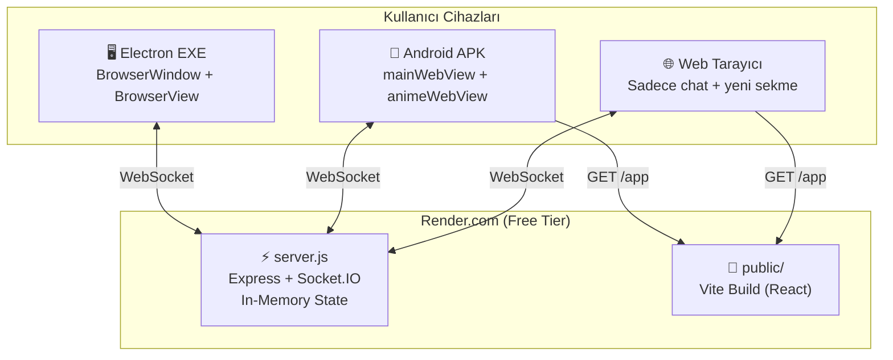

# Mimari Genel Bakış

> AniSync sistem mimarisi, veri akışı ve tasarım kararları.

## Üst Düzey Mimari



## Platform Farkları

| Özellik | EXE (Electron) | APK (Android) | Web |
|---------|----------------|---------------|-----|
| Video gösterim | BrowserView (ayrı process) | animeWebView (system WebView) | Yeni sekme |
| UI rendering | BrowserWindow (React) | mainWebView (React) | Tarayıcı (React) |
| Video kontrolü | Injected JS → IPC → preload | AniSyncBridge (Java ↔ JS) | Yok |
| Sync gönderme | ✅ Host olarak | ❌ Sadece alır | ❌ |
| Sync alma | ✅ seek/play/pause | ✅ controlAnime() | ❌ |
| Offline desteği | ❌ | ❌ | ❌ |
| Paketleme | electron-builder | Gradle (APK) | Yok (URL) |

## Veri Akışı

### Anime URL Paylaşımı
```
PC Host anime sitesini açar
  → BrowserView URL değişir
  → onNavigated callback tetiklenir
  → socket.emit('sync:url-changed', { url })
  → Sunucu: room.currentUrl = url
  → io.to(roomId).emit('sync:url-changed')
  → APK: AniSyncBridge.openAnime(url) → animeWebView.loadUrl(url)
  → Web: useSyncStore.setCurrentUrl(url)
```

### Video Sync (Play/Pause/Seek)
```
PC'de video event oluşur
  → Injected JS: lastEvent = { type, time, ts }
  → 500ms poll: anisync.player.getEvent()
  → socket.emit('sync:play/pause/seek', { time })
  → Sunucu: room.syncState güncellenir + broadcast
  → Diğer PC'ler: anisync.player.seek(time) + play/pause()
  → APK'lar: bridge.controlAnime(action, time)
```

### Chat
```
Kullanıcı mesaj yazar → socket.emit('chat:message', { text })
  → Sunucu: { id, userId, username, text, timestamp } oluşturur
  → io.to(roomId).emit('chat:message', msg)
  → Tüm client'lar: useChatStore.addMessage(msg)
  → React re-render: ChatPanel güncellenir
```

## Tasarım Kararları

### Neden iframe değil BrowserView?
- CORS kısıtlamaları: iframe ile anime siteleri yüklenemez
- X-Frame-Options: Çoğu site iframe'ı engeller
- BrowserView: Tam tarayıcı, ayrı process, kısıtlama yok

### Neden tek dosya sunucu?
- Basitlik: Render.com free tier için ideal
- Bağımlılık: Sadece express + socket.io + cors
- Deploy: `git push` ile anında deploy
- Trade-off: Veritabanı yok, sunucu restart = veri kaybı

### Neden Zustand?
- Minimal: ~1KB, hiç boilerplate yok
- React dışından erişim: `useStore.getState()` — socket handler'larda kritik
- Selector: Fine-grained re-render optimizasyonu

### Neden in-memory state?
- Free tier PostgreSQL limitleri
- Oda bilgileri geçici (izleme bitince oda kapanır)
- Chat geçmişi saklanmasına gerek yok
- Basitlik ve hız öncelikli

### Neden ayrı git repo (render-server)?
- Render.com bir repo'ya bağlanır ve o repo'nun root'unu deploy eder
- Monorepo'da packages/render-server/ alt dizini doğrudan deploy edilemez
- Ayrı repo = doğrudan push → deploy

## Güvenlik Notları

- **Auth yok**: Sadece username ile giriş (password yok)
- **CORS**: `origin: '*'` — herkes bağlanabilir
- **Avatar**: Base64 encoded, client-side resize (128x128)
- **Chat**: Max 500 karakter, sunucu tarafında trim
- **Oda kodu**: 6 karakter (26 harf + 8 rakam = ~1.07 milyar kombinasyon)

## Ölçeklendirme Sınırları

- **Max üye/oda**: 10 (sabit kod)
- **Max oda**: Sınırsız (memory'ye bağlı)
- **Socket.IO**: Tek instance, horizontal scaling yok
- **Render.com free**: 512MB RAM, 0.1 CPU
- **Keep-alive**: 5 dakikada bir self-ping

## İlgili Sayfalar

- [[Teknoloji Stack]] — Kullanılan teknolojiler
- [[Dosya Yapısı]] — Proje yapısı
- [[Senkronizasyon]] — Sync detayları
- [[Socket Olayları]] — Event referansı
